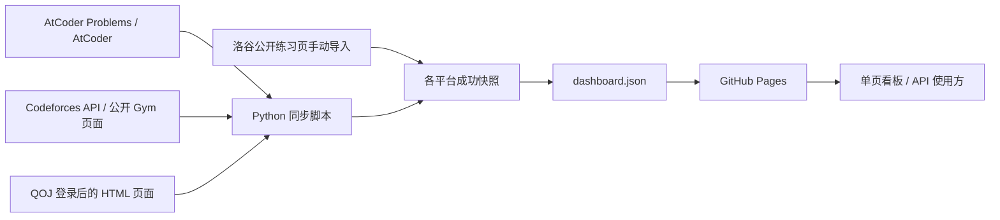

# Lucius7 · 解题日志

[](https://github.com/theLucius7/qwq/actions/workflows/pages.yml)

一个部署在 GitHub Pages 的个人算法做题看板：汇总 Lucius7 的 AtCoder、Codeforces、QOJ 提交记录与洛谷公开通过题目，在同一页展示解题概况、每日 AC 记录和比赛进度。AtCoder / Codeforces 与已配置登录态的 QOJ 每日同步；洛谷使用手动导入快照。

[在线查看](https://thelucius7.github.io/qwq/) · [API 文档](docs/API.md) · [OpenAPI 3.1](docs/openapi.json) · [公开数据](https://thelucius7.github.io/qwq/data/dashboard.json) · [同步记录](https://github.com/theLucius7/qwq/actions/workflows/pages.yml)

## 功能

- **单页看板**：累计解题、本月新增、今日首次 AC、连续做题天数，以及 AtCoder / Codeforces 的当前 / 最高 Rating。
- **每日记录**：按年份、平台查看热力图，点击日期查看题目、难度和提交时间；支持首次 AC 与全部 AC，首次通过用 `✓` 标记。
- **比赛进度**：以题目矩阵区分已 AC、尝试过和未完成，支持类别、完成状态和题目搜索；默认显示有提交记录的比赛。
- **未知时间单独展示**：洛谷已通过题目计入累计解题，但不编造 AC 时间，不计入热力图、每日新增或连续天数；支持题号、名称、难度搜索。
- **自动更新**：GitHub Actions 每天同步 AtCoder / Codeforces 与已配置登录态的 QOJ，保留上次成功数据并提示故障；洛谷快照仅在手动导入时更新。
- **可复用数据**：浏览器读取同源 JSON，其他程序也可以直接获取快照；前端无框架，构建和同步无第三方运行依赖。

## 平台支持

| 平台 | 当前发布状态 | 数据范围 |
| --- | --- | --- |
| AtCoder | 已接入 | AtCoder Problems 收录的公开提交、题库、比赛映射、估计难度；官方 Algorithm Rating |
| Codeforces | 已接入 | 官方 API 可见的提交、题库、比赛和 Rating；已提交的公开 Gym 题表 |
| QOJ | 已接入；配置 Cookie 后每日同步 | 登录后的提交历史及实际提交涉及的比赛；不展示全站比赛目录 |
| 洛谷 | 已接入手动快照；自动同步未启用 | 公开练习页的通过题目与已尝试题目，无提交时间、逐条提交历史或比赛进度 |

公开 API 当前为 **`schemaVersion: 2`**，平台为 `atcoder`、`codeforces`、`qoj`、`luogu`。洛谷首次导入确认 **547 道通过题目**，全部标为 AC 时间未知；QOJ 首次快照只含实际有提交记录的 **10 场比赛**。2026-09-08 首次四源汇总为 1,687 道已解题、1,324 次有时间的 AC，547 题时间未知。这些是导入时的数量，最新数据以线上快照为准。来源范围和配置方式见 [API 文档](docs/API.md#上游数据获取)。

## 快速开始

需要 **Node.js 22+**、**Python 3.11+** 和 Git。CI 使用 Node.js 22、Python 3.12。无需运行 `npm install` 或 `pip install`。

```sh
git clone https://github.com/theLucius7/qwq.git
cd qwq
npm run dev
```

打开 [本地预览](http://127.0.0.1:4173)。仓库包含已生成快照，预览不会向上游平台发起请求。

| 命令 | 用途 |
| --- | --- |
| `npm run dev` | 在 `127.0.0.1:4173` 提供 `public/`，按 Ctrl+C 停止 |
| `npm run sync` | 获取 AtCoder / Codeforces 与已配置 QOJ 的提交历史；复用洛谷手动快照并生成看板 JSON |
| `python3 scripts/sync.py --offline` | 使用已有平台快照重新生成 JSON，不联网 |
| `npm test` | 运行 JavaScript 与 Python 的统计、分页、目录和降级测试 |
| `npm run build` | 校验数据并将静态网站输出到 `dist/` |

手动数据的文件格式与 `python3 scripts/import_browser.py` 使用方式见 [浏览器数据导入](docs/API.md#手动导入已保存的浏览器数据)。

离线重建重新汇总已有快照，不代表上游数据已刷新。本项目当前为 Lucius7 的单用户看板；没有通过 URL 参数或环境变量切换 AtCoder / Codeforces 用户的功能。Fork 后更换用户需要修改同步脚本的 `HANDLE`、洛谷规范化器的 UID / HANDLE、页面个人资料链接，并替换旧用户快照后重新同步和校验；QOJ 可用 `QOJ_HANDLE` 配置。

## API 使用

公开接口为无需认证的静态 `GET`，返回整个看板快照：

```sh
curl --fail --silent --show-error \
  'https://thelucius7.github.io/qwq/data/dashboard.json' \
  --output dashboard.json
```

```js
const response = await fetch('https://thelucius7.github.io/qwq/data/dashboard.json');
if (!response.ok) throw new Error(`HTTP ${response.status}`);
const data = await response.json();
if (data.schemaVersion !== 2) throw new Error('不支持的数据版本');
const solved = new Set([...data.accepted.map(event => event.problemId), ...data.undatedSolved]);
console.log('已解题数', solved.size, 'AC 时间未知', data.undatedSolved.length);
```

完整字段、JavaScript / Python 示例、分页获取方法、认证要求和失败处理见 [API 文档](docs/API.md)。[OpenAPI 文件](docs/openapi.json) 可导入支持 OpenAPI 3.1 的工具；它描述本仓库的公开接口，上游接口由各平台自行维护。

## 数据流程与统计口径



| 指标 | 口径 |
| --- | --- |
| 累计已解题 | `accepted` 中的题目 ID 与 `undatedSolved` 取并集；跨平台题号分别计数 |
| 每日新增 | 只对有真实提交时间的通过记录按题目 ID 取最早一次；AtCoder `AC`、Codeforces `OK`、QOJ 满分或明确 AC |
| 全部 AC | 已获取的有时间通过提交次数，含重复通过；不代表四个平台完整 AC 总次数 |
| 时间 | 采用通过提交的**提交时间**，不是评测完成时间；按 UTC+8 自然日归档；洛谷采集时间不作为 AC 时间 |
| 连续做题 | 只统计已知时间的 AC；今天尚未 AC 时可延续到昨天；洛谷记录不参与 |
| 比赛进度 | 以比赛题目列表统计全历史通过情况，正式赛、练习、虚拟赛均可贡献进度 |
| 比赛参与 | 以该比赛是否实际有提交为准；共享题在别场通过不会被算成在本场提交 |
| 目录缺失 | 进度分母显示 `?`，不误判为整场完成 |

AtCoder 的共享题使用同一题目 ID；Codeforces 使用 `contestId + index`，不按标题合并跨 Div 题目，因此进度可能与 CFTracker 不同。难度缺失为 `null`，不虚构为 0。私人、隐藏、不可访问或上游未收录的数据不在统计范围内。

## 自动同步与 GitHub Pages

工作流 [Daily sync and GitHub Pages](.github/workflows/pages.yml) 在以下情况运行：

- 每天 **08:17（Asia/Taipei / UTC+8）**，对应 cron `17 0 * * *`。
- 推送到 `main`。
- 在 Actions 页面选择该工作流，再点击 **Run workflow** 手动运行。

GitHub 的定时任务可能排队延迟；它不是精确到分钟的定时服务。运行流程为：测试 → 同步 → 构建 → 提交数据快照 → 发布 `dist/`。数据提交带 `[skip ci]` 标记。

自行部署时：

1. Fork 或建立包含本项目的仓库，确保发布分支为 `main`。
2. 在 **Settings → Pages → Build and deployment → Source** 选择 **GitHub Actions**。
3. 确认 Actions 已启用，并允许工作流使用其声明的权限：构建阶段写回仓库数据，部署阶段写入 Pages 并获取 OIDC 身份令牌。组织策略或分支保护若禁止机器人写回，需先调整对应仓库策略。
4. 手动运行工作流，成功后从 `github-pages` 环境查看站点地址。

AtCoder / Codeforces 同步不需要手动配置 API Key、Cookie 或个人 GitHub Token。QOJ 需要维护者在仓库 **Settings → Secrets and variables → Actions → New repository secret** 手动设置 `QOJ_COOKIE`；可选仓库变量 `QOJ_HANDLE` 默认 `Lucius7`。Cookie 失效后更新 Secret 并重新运行工作流，旧数据会保留并告警。浏览器登录不会自动把登录态传给 Actions；不要把 Cookie 提交到仓库或发到聊天。洛谷不需要 Cookie，且定时工作流不会抓取洛谷。工作流使用 GitHub 自动提供的 `GITHUB_TOKEN`。Fork 后需检查并启用定时工作流；长期无活动的公开仓库可能被 GitHub 停用定时任务。参考 [Pages 自定义工作流](https://docs.github.com/en/pages/getting-started-with-github-pages/using-custom-workflows-with-github-pages) 与 [schedule 说明](https://docs.github.com/en/actions/reference/workflows-and-actions/events-that-trigger-workflows#schedule)。

### 数据新鲜度与故障处理

对 AtCoder / Codeforces 与已配置 QOJ 每天完整重新读取提交历史，以反映重判和延迟判题；洛谷始终复用手动快照，不向洛谷发起自动请求。每个平台校验成功后原子替换自己的快照。核心获取失败时保留该平台的旧数据，其他平台仍可更新；AtCoder / Codeforces 首次获取失败且无快照时中止发布；QOJ 首次未配置或失败、洛谷尚未导入时标记为未连接，不伪造零条记录。

降级数据仍会部署，随后工作流报告失败以提示维护者。Rating、估计难度和 Gym 题表属于可选数据，失败时会产生单独提示。网页根据每个平台的 `lastSuccess` 判断新鲜度，超过 36 小时也会提示；汇总的 `generatedAt` 不能替代这个判断。具体回退规则见 [错误与新鲜度](docs/API.md#错误与新鲜度)。

## 项目结构

```text
.github/workflows/
  pages.yml              # 定时同步、快照提交、Pages 部署
  check.yml              # Pull request 的测试与构建
data/sources/            # 每个平台的上次成功快照
docs/
  API.md                 # 接口与上游数据获取说明
  openapi.json           # OpenAPI 3.1 契约
public/
  index.html             # 单页布局、个人资料与来源链接
  app.js                 # 交互与渲染
  model.js               # 日期、首次 AC、连续天数、比赛进度
  styles.css             # 样式
  data/dashboard.json    # 发布给浏览器与 API 使用方的数据
scripts/
  sync.py                # 获取、规范化、校验与快照合并
  qoj.py                 # 已登录 QOJ 提交与比赛 HTML 解析
  import_browser.py      # 已保存浏览器数据的导入 CLI
  qoj_import.py          # 已导出 QOJ 页面数据的离线规范化
  luogu.py               # 洛谷公开练习页手动数据的离线规范化
  build.mjs              # 静态构建
tests/                   # JavaScript 与 Python 测试
```

修改统计逻辑或同步器后运行 `npm test` 与 `npm run build`。接口字段发生变化时同步更新 [API 文档](docs/API.md) 和 [OpenAPI 契约](docs/openapi.json)。`data/sources/` 是同步缓存，不是稳定的公开 API；`dist/` 为构建产物，不提交到 Git。

## 数据来源与致谢

- [AtCoder Problems API](https://github.com/kenkoooo/AtCoderProblems/blob/master/doc/api.md)：社区维护的 AtCoder 数据服务；[Lucius7 题表](https://kenkoooo.com/atcoder/#/table/Lucius7)。
- [AtCoder 官方个人主页](https://atcoder.jp/users/Lucius7)与 [Rating 历史](https://atcoder.jp/users/Lucius7/history/json)。
- [Codeforces 官方 API](https://codeforces.com/apiHelp)、[个人主页](https://codeforces.com/profile/Lucius7)与公开 Gym 比赛页。
- [CFTracker](https://cftracker.netlify.app/contests)：比赛进度展示参考；本项目直接获取 Codeforces 数据。
- [QOJ 个人主页](https://qoj.ac/user/profile/Lucius7)：登录后的提交与比赛页面。
- [洛谷公开练习页](https://www.luogu.com.cn/user/571082/practice)：手动保存的通过题目快照，提供来源与采集时间。

页面头像使用 [theLucius7 的 GitHub 头像](https://github.com/theLucius7.png)。项目数据文件仅保存展示所需的题目与提交元数据，不保存提交源码或登录凭据；QOJ Cookie 仅通过运行环境中的 GitHub Secret 使用。上游数据与题目的权利归各自权利人所有。
