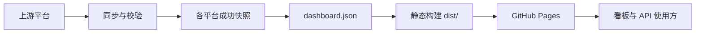

# OJFlare

**Lucius7 的多平台算法解题日志。** 汇总 AtCoder、Codeforces、QOJ 与牛客公开编程练习记录，在一个静态看板中查看累计解题趋势、每日 AC、Rating 和比赛进度。

[](https://github.com/xw7qwq/ojflare/actions/workflows/pages.yml)

[在线访问](https://ojflare.lucius7.dev) · [API 文档](docs/API.md) · [OpenAPI 3.1](docs/openapi.json) · [公开数据](https://ojflare.lucius7.dev/data/dashboard.json) · [反馈问题](https://github.com/xw7qwq/ojflare/issues)

OJFlare 使用独立域名 **[ojflare.lucius7.dev](https://ojflare.lucius7.dev)**。算法题解源码另见 [CodeFlare](https://github.com/xw7qwq/codeflare)（[codeflare.lucius7.dev](https://codeflare.lucius7.dev)）；两个仓库分别维护源码归档与解题统计。

## 目录

- [功能](#功能)
- [平台与数据范围](#平台与数据范围)
- [快速开始](#快速开始)
- [配置与数据更新](#配置与数据更新)
- [公开 API](#公开-api)
- [统计口径](#统计口径)
- [部署](#部署)
- [项目结构](#项目结构)
- [开发与贡献](#开发与贡献)
- [数据来源与致谢](#数据来源与致谢)
- [许可证与数据归属](#许可证与数据归属)

## 功能

- **解题趋势**：累计首次 AC 曲线，今日、本月及连续做题天数摘要；支持鼠标、触摸和方向键查看日期。
- **每日记录**：按平台、年份查看热力图，选择日期查看题目、难度和提交时间；可切换首次 AC 与全部 AC。
- **个人概况**：展示各平台已解题数、AtCoder / Codeforces 当前及最高 Rating，以及牛客当前 Rating。
- **比赛进度**：仅展示有实际提交的比赛，按 A / B / C… 对齐题目；标记已 AC、尝试过和未完成，支持类别、完成状态及题目搜索。
- **自动同步**：GitHub Actions 每日更新数据；上游失败时尽可能保留成功快照，并在页面提示数据状态。
- **静态部署**：原生 HTML / CSS / JavaScript 前端、Python 标准库同步器；无数据库、无第三方运行依赖，公开 JSON 可独立使用。

## 平台与数据范围

| 平台 | 接入方式 | 当前范围 |
| --- | --- | --- |
| AtCoder | AtCoder Problems 与官方公开数据 | 公开提交、题库、比赛映射、估计难度，以及官方 Algorithm Rating |
| Codeforces | 官方 API 与公开 Gym 页面 | API 可见的提交、题库、比赛和 Rating；补充已提交的公开 Gym 题表 |
| QOJ | 登录后的 HTML 页面 | 配置 `QOJ_COOKIE` 后同步提交历史，以及实际提交涉及的比赛 |
| 牛客 | 无需登录的公开编程练习页面 | UID `423062492` / `theLucius7` 的练习提交与当前 Rating；不生成比赛进度 |
| 洛谷 | 暂时停用 | 不请求、不导出、不计入统计；只保留内部历史适配器与快照 |

当前看板固定展示 Lucius7 的账号，启用平台为 `atcoder`、`codeforces`、`qoj`、`nowcoder`。牛客数据明确标为 `practice_coding`，其比赛内提交是否包含在练习列表中尚未确认。私人、隐藏、不可访问或上游未收录的记录不在统计范围内。

完整来源与获取方式见 [上游数据获取](docs/API.md#上游数据获取)。

## 快速开始

需要 **Git、Node.js 22+（含 npm）、Python 3.11+**。CI 使用 Node.js 22 与 Python 3.12；无需执行 `npm install` 或 `pip install`。

```sh
git clone https://github.com/xw7qwq/ojflare.git
cd ojflare
npm run dev
```

打开 [http://127.0.0.1:4173](http://127.0.0.1:4173)，按 `Ctrl+C` 停止服务。仓库自带已生成的数据快照，本地预览不会触发上游记录同步。

| 命令 | 用途 |
| --- | --- |
| `npm run dev` | 在 `127.0.0.1:4173` 预览 `public/` |
| `npm run sync` | 联网同步启用的平台，并生成 `public/data/dashboard.json` |
| `python3 scripts/sync.py --offline` | 只用已有平台快照重新汇总，不发起网络请求 |
| `npm test` | 运行 JavaScript 与 Python 测试 |
| `npm run build` | 校验公开数据，并把静态站点输出到 `dist/` |

`npm run build` 不自动获取新数据；`dist/` 是构建产物，不提交到 Git。

`main` 中的快照是离线开发基线；最新自动同步结果保存在长期分支 `data/snapshots`。需要复现线上数据时，可执行以下命令恢复缓存和公开 JSON；它会替换本地快照，先保存未提交的手动导入数据。

```sh
git clone --single-branch --branch data/snapshots https://github.com/xw7qwq/ojflare.git .snapshots
rsync -a --delete .snapshots/data/sources/ data/sources/
cp .snapshots/public/data/dashboard.json public/data/dashboard.json
```

`.snapshots/` 被 Git 忽略。已有该目录时，在恢复前运行 `git -C .snapshots pull --ff-only`，无需重复克隆；恢复数据供本地验证，不需要提交到源码分支。

## 配置与数据更新

### 账号与认证

AtCoder、Codeforces 和牛客无需配置 API Key、Cookie 或个人 GitHub Token。QOJ 自动同步使用以下配置：

| 配置 | GitHub Actions 中的位置 | 说明 |
| --- | --- | --- |
| `QOJ_COOKIE` | Repository secret | 正常登录 QOJ 后的有效 Cookie；启用 QOJ 自动同步时需要 |
| `QOJ_HANDLE` | Repository variable | 可选，默认 `Lucius7` |

在仓库 **Settings → Secrets and variables → Actions** 配置；本地运行时，同名环境变量也会生效。浏览器登录态不会自动传给 Actions。Cookie 失效后更新 Secret，再运行同步；不要将 Cookie 写入源码、数据文件或提交到仓库。

项目尚未提供通用的多用户配置。Fork 后更换账号，需要修改 [同步器](scripts/sync.py) 的 `HANDLE`、[牛客适配器](scripts/nowcoder.py) 的 `UID` / `HANDLE` 和 [页面](public/index.html) 中的个人链接，并替换旧用户快照后重新同步、测试和构建。QOJ 的 `QOJ_HANDLE` 必须与对应快照账号一致。

### 同步策略与故障处理

AtCoder / Codeforces 与已配置登录态的 QOJ 每次在线同步重新读取提交历史，以反映重判和延迟判题。牛客每天最多采集一次，通常增量更新，首次及每七天核对完整历史；每次最多 80 个分页请求，间隔至少 2.2 秒，不重试。同日再次运行会复用缓存；访问拒绝或页面结构异常时暂停采集。

各平台校验成功后原子替换自己的快照，汇总结果写入 `public/data/dashboard.json`：

| 情况 | 处理方式 |
| --- | --- |
| 核心同步失败，已有成功快照 | 保留该平台旧数据，其他平台仍可更新，页面显示提示 |
| AtCoder / Codeforces 首次失败且无快照 | 中止本次发布，避免把不完整记录发布为完整看板 |
| QOJ / 牛客尚未连接且无快照 | 标记为等待连接或错误，不伪造零条提交 |
| Rating、估计难度或 Gym 题表获取失败 | 单独记录 warning；可用数据仍可发布 |
| 使用 `--offline` | 重新汇总已有记录，保留来源采集时间，不代表上游已刷新 |

页面以各平台 `lastSuccess` 判断新鲜度，超过 36 小时会提示；`generatedAt` 只表示汇总时间。若存在核心来源降级，工作流会先部署可用数据，再报告失败，提醒维护者检查。[错误与新鲜度](docs/API.md#错误与新鲜度) 记录了完整回退规则。

牛客请求预算与暂停状态保存在 `data/sources/nowcoder-request.json`。需排查采集范围、预算或暂停原因时，参阅 [牛客数据说明](docs/API.md#牛客公开编程练习提交)。已有浏览器数据的离线导入格式与命令见 [手动导入说明](docs/API.md#手动导入已保存的浏览器数据)。洛谷内部存档的导入或状态修改不会恢复其公开接入。

## 公开 API

生产接口为无需认证的静态 `GET`：

```sh
curl --fail --silent --show-error --max-time 45 \
  'https://ojflare.lucius7.dev/data/dashboard.json' \
  --output dashboard.json
```

响应一次返回完整看板快照；平台和日期筛选在客户端完成，不提供写入、实时查询或通过 URL 参数切换账号的接口。当前数据版本为 **`schemaVersion: 2`**。

```js
const response = await fetch('https://ojflare.lucius7.dev/data/dashboard.json');
if (!response.ok) throw new Error(`HTTP ${response.status}`);
const data = await response.json();
if (data.schemaVersion !== 2) throw new Error('不支持的数据版本');

const solved = new Set([
  ...data.accepted.map(event => event.problemId),
  ...data.undatedSolved,
]);
console.log('已解题数', solved.size);
```

HTTP 200 不代表每个平台刚刚同步成功，使用方还应检查 `sources` 中的 `lastSuccess`、`error` 与 `warnings`。`undatedSolved` 保留兼容性，当前为空数组。完整字段、JavaScript / Python 示例与版本规则见 [API 文档](docs/API.md)；[OpenAPI 契约](docs/openapi.json) 描述本项目的公开接口。

## 统计口径

| 指标 | 计算规则 |
| --- | --- |
| 累计已解题 | `accepted` 中的题目 ID 与 `undatedSolved` 取并集；跨平台题号分别计数 |
| 每日新增 / 解题曲线 | 对有真实提交时间的通过记录，按题目 ID 取已获取历史中的最早一次 AC |
| 全部 AC | 已获取且有时间的通过提交次数，包含重复通过；不等于所有平台完整 AC 总次数 |
| 日期 | 使用通过提交的提交时间，按 `Asia/Taipei`（UTC+8）自然日归档 |
| 连续做题 | 只使用有时间的 AC；今天尚未 AC 时允许延续到昨天 |
| 比赛进度 | 按比赛题表计算全历史通过情况，正式赛、练习和虚拟赛均可贡献进度 |
| 比赛范围 | 仅包含 `hasSubmissions === true` 的比赛；共享题在别场通过不等于本场有提交 |
| 目录或难度缺失 | 不完整题表的分母显示 `?`，不判定整场完成；未知难度为 `null` |

AtCoder 共享题使用同一题目 ID；Codeforces 使用 `contestId + index`，不按标题合并跨 Div 题目，进度可能与 CFTracker 不同。通过判定与题目关联的细节见 [统计与关联规则](docs/API.md#统计与关联规则)。

## 部署

正式站点为 **[ojflare.lucius7.dev](https://ojflare.lucius7.dev)**，通过 GitHub Pages 发布。[同步与部署工作流](.github/workflows/pages.yml) 在以下情况运行：

- 每天 **08:17（Asia/Taipei / UTC+8）**，cron 为 `17 0 * * *`，实际启动可能因排队延迟。
- 推送到 `main`。
- 在 Actions 页面手动运行 **Daily sync and GitHub Pages**。



工作流分别检出 `main` 源码和 `data/snapshots` 数据，恢复最新快照与请求预算后执行测试、同步、写回数据分支、构建和发布。数据分支仅包含 `data/sources/` 与 `public/data/dashboard.json`，保留成功数据及上游失败时的回退状态。源码检出不保存 Git 凭证，自动化不再直接写入 `main`；数据提交不会触发仅监听 `main` 的 push 工作流，因此不使用 `[skip ci]`。

### 自行部署

1. Fork 或建立包含本项目的仓库，源码分支使用 `main`，并保留包含最新快照的 `data/snapshots` 分支。Fork 时不要选择仅复制默认分支；缺少数据分支时，从本仓库推送该分支到自己的远端后再启动部署。
2. 在 **Settings → Pages → Build and deployment → Source** 选择 **GitHub Actions**。
3. 启用 Actions，并允许工作流声明的权限：构建任务只向 `data/snapshots` 写回数据，部署任务写入 Pages 并获取 OIDC 身份令牌。`main` 可以强制 PR 和必需检查，数据分支允许 `GITHUB_TOKEN` 正常推送且禁止强推和删除，无需绕过主分支规则。
4. 按需配置 QOJ Secret / Variable，手动运行部署工作流，从 `github-pages` 环境查看部署地址。
5. 使用自己的域名时，在 **Settings → Pages → Custom domain** 配置并完成 DNS 与 HTTPS 设置；同步修改 `public/CNAME`、页面 canonical、README 与 API 文档中的公开地址。

工作流使用 GitHub 自动提供的 `GITHUB_TOKEN`，不需要额外的个人 Token。Fork 后需检查定时工作流是否启用；长期无活动的公开仓库可能被停用定时任务。参考 [Pages 自定义工作流](https://docs.github.com/en/pages/getting-started-with-github-pages/using-custom-workflows-with-github-pages)、[自定义域名](https://docs.github.com/en/pages/configuring-a-custom-domain-for-your-github-pages-site) 与 [schedule 说明](https://docs.github.com/en/actions/reference/workflows-and-actions/events-that-trigger-workflows#schedule)。

也可以将 `npm run build` 生成的 `dist/` 整体交给其他静态托管服务；数据同步仍需单独运行。

## 项目结构

```text
.github/workflows/
  pages.yml              # main 源码 + data/snapshots 定时同步与 Pages 部署
  check.yml              # Pull request 测试与构建
data/sources/            # 平台成功快照及请求状态；内部缓存
docs/
  API.md                 # 公开接口、上游来源与故障处理
  openapi.json           # OpenAPI 3.1 契约
public/
  CNAME                  # 自定义域名，构建时复制到 dist/
  index.html             # 页面布局、个人资料与来源链接
  app.js                 # 交互与渲染
  model.js               # 日期、首次 AC、连续天数与比赛进度
  trend.js               # 累计解题曲线
  styles.css             # 页面样式
  data/dashboard.json    # 浏览器与 API 使用方读取的快照
scripts/
  sync.py                # 同步入口、规范化、校验与汇总
  qoj.py                 # QOJ 提交与比赛 HTML 解析
  nowcoder.py            # 牛客公开编程练习增量与全量采集
  import_browser.py      # 已保存浏览器数据的离线导入入口
  qoj_import.py          # QOJ 离线数据规范化
  luogu.py               # 洛谷历史适配器，当前未启用
  build.mjs              # 数据校验与静态构建
tests/                   # JavaScript 与 Python 测试
```

## 开发与贡献

欢迎通过 [Issue](https://github.com/xw7qwq/ojflare/issues) 报告问题，或提交 [Pull request](https://github.com/xw7qwq/ojflare/pulls) 改进展示、文档和数据处理。

- 报告数据问题时，附上平台、题目或比赛链接、预期行为及复现步骤；不要附带登录凭据或提交源码。
- 修改统计模型或同步器时，补充对应边界条件测试，并执行 `npm test` 与 `npm run build`。Pull request 工作流也会运行这两个检查。
- 修改公开字段时，同时更新 [API 文档](docs/API.md)、[OpenAPI 契约](docs/openapi.json) 与相关测试，评估是否需要升级 `schemaVersion`。
- `data/sources/` 是同步缓存，不是稳定的公开 API。开发时可先使用已有快照，避免重复触发在线采集。

## 数据来源与致谢

- [AtCoder Problems API](https://github.com/kenkoooo/AtCoderProblems/blob/master/doc/api.md)：社区维护的公开提交、题库、比赛映射与难度数据；[Lucius7 题表](https://kenkoooo.com/atcoder/#/table/Lucius7)。
- [AtCoder 官方个人主页](https://atcoder.jp/users/Lucius7)与 [Rating 历史](https://atcoder.jp/users/Lucius7/history/json)。
- [Codeforces 官方 API](https://codeforces.com/apiHelp)、[个人主页](https://codeforces.com/profile/Lucius7)与公开 Gym 比赛页。
- [CFTracker](https://cftracker.netlify.app/contests)：比赛进度展示参考；本项目直接获取 Codeforces 数据。
- [QOJ 个人主页](https://qoj.ac/user/profile/Lucius7)：登录后的提交与比赛页面。
- [牛客公开编程练习](https://ac.nowcoder.com/acm/contest/profile/423062492/practice-coding)：提交结果、题号、名称与提交时间。
- [洛谷公开练习页](https://www.luogu.com.cn/user/571082/practice)：历史快照来源，缺少 AC 时间；当前已停用。

页面头像通过腾讯 `q1.qlogo.cn` 加载 [QQ 3012967200 的头像](https://q1.qlogo.cn/g?b=qq&nk=3012967200&s=100)。公开数据仅保存展示所需的题目和提交元数据，不保存提交源码或登录凭据。

## 许可证与数据归属

仓库当前未附带 `LICENSE` 文件。上游题目、平台数据与头像的权利归各自权利人所有。
