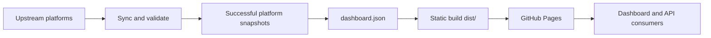

# OJFlare

**Lucius7's cross-platform programming practice journal.** A static dashboard combines public AtCoder, Codeforces, QOJ, and Nowcoder practice records to show cumulative solving trends, daily accepted (AC) submissions, ratings, and contest progress.

[](https://github.com/xw7qwq/ojflare/actions/workflows/pages.yml)

[Website](https://ojflare.lucius7.dev) · [API documentation](docs/API.md) · [OpenAPI 3.1](docs/openapi.json) · [Public data](https://ojflare.lucius7.dev/data/dashboard.json) · [Report an issue](https://github.com/xw7qwq/ojflare/issues)

OJFlare uses the custom domain **[ojflare.lucius7.dev](https://ojflare.lucius7.dev)**. Algorithm source code lives in [CodeFlare](https://github.com/xw7qwq/codeflare) ([codeflare.lucius7.dev](https://codeflare.lucius7.dev)). The repositories maintain the source archive and solving statistics separately.

## Contents

- [Features](#features)
- [Platforms and data coverage](#platforms-and-data-coverage)
- [Quick start](#quick-start)
- [Configuration and data updates](#configuration-and-data-updates)
- [Public API](#public-api)
- [Statistics](#statistics)
- [Deployment](#deployment)
- [Project layout](#project-layout)
- [Development and contributions](#development-and-contributions)
- [Data sources and acknowledgments](#data-sources-and-acknowledgments)
- [License and data ownership](#license-and-data-ownership)

## Features

- **Solving trends**: cumulative first-AC charts and summaries for today, this month, and solving streaks. Explore dates with a mouse, touch, or arrow keys.
- **Daily records**: heatmaps by platform and year, with problems, difficulty, and submission times for each date. Switch between first ACs and all ACs.
- **Profile**: solved counts per platform, current and peak AtCoder / Codeforces ratings, and current Nowcoder rating.
- **Contest progress**: only contests with actual submissions appear. Problems align by A / B / C, with accepted, attempted, and unfinished states, plus filters for category, completion, and problem search.
- **Automatic synchronization**: GitHub Actions updates data daily. Successful snapshots are preserved where possible after upstream failures, and the page displays source status.
- **Static deployment**: plain HTML / CSS / JavaScript frontend and a Python standard-library synchronizer, with no database or third-party runtime dependencies. Public JSON can be used independently.

## Platforms and data coverage

| Platform | Access method | Current coverage |
| --- | --- | --- |
| AtCoder | AtCoder Problems and official public data | Public submissions, problems, contest mappings, estimated difficulty, and official Algorithm rating |
| Codeforces | Official API and public Gym pages | API-visible submissions, problems, contests, and ratings, supplemented with problem lists for public Gym contests with submissions |
| QOJ | Authenticated HTML pages | Submission history and contests with actual submissions, when `QOJ_COOKIE` is configured |
| Nowcoder | Public coding-practice pages without authentication | Practice submissions and current rating for UID `423062492` / `theLucius7`; no contest progress |
| Luogu | Temporarily disabled | No requests, exports, or statistical contribution; only historical internal adapters and snapshots remain |

The dashboard currently displays Lucius7's accounts. Enabled platforms are `atcoder`, `codeforces`, `qoj`, and `nowcoder`. Nowcoder data is explicitly labeled `practice_coding`; whether its practice list includes in-contest submissions has not been confirmed. Private, hidden, inaccessible, or upstream-unlisted records are outside the scope.

See [upstream data collection](docs/API.md#upstream-data-collection) for sources and access methods.

## Quick start

Requires **Git, Node.js 22+ (including npm), and Python 3.11+**. CI uses Node.js 22 and Python 3.12. No `npm install` or `pip install` step is needed.

```sh
git clone https://github.com/xw7qwq/ojflare.git
cd ojflare
npm run dev
```

Open [http://127.0.0.1:4173](http://127.0.0.1:4173), and stop the server with `Ctrl+C`. The repository includes generated snapshots; local preview does not synchronize upstream records.

| Command | Purpose |
| --- | --- |
| `npm run dev` | Preview `public/` at `127.0.0.1:4173` |
| `npm run sync` | Synchronize enabled platforms online and generate `public/data/dashboard.json` |
| `python3 scripts/sync.py --offline` | Rebuild the aggregate using existing platform snapshots, without network requests |
| `npm test` | Run JavaScript and Python tests |
| `npm run build` | Validate public data and write the static site to `dist/` |

`npm run build` does not fetch fresh data. `dist/` is generated output and is not committed to Git.

Snapshots on `main` are the offline development baseline. The latest automated results live on the permanent `data/snapshots` branch. To reproduce online data, restore caches and public JSON with the following commands. This replaces local snapshots, so save uncommitted manual imports first.

```sh
git clone --single-branch --branch data/snapshots https://github.com/xw7qwq/ojflare.git .snapshots
rsync -a --delete .snapshots/data/sources/ data/sources/
cp .snapshots/public/data/dashboard.json public/data/dashboard.json
```

Git ignores `.snapshots/`. If it already exists, run `git -C .snapshots pull --ff-only` before restoration instead of cloning again. Restored data is for local validation and does not need to be committed to the source branch.

## Configuration and data updates

### Accounts and authentication

AtCoder, Codeforces, and Nowcoder do not require API keys, cookies, or personal GitHub tokens. QOJ synchronization uses these settings:

| Setting | GitHub Actions location | Description |
| --- | --- | --- |
| `QOJ_COOKIE` | Repository secret | A valid cookie from a normal QOJ login; required for automatic QOJ synchronization |
| `QOJ_HANDLE` | Repository variable | Optional; defaults to `Lucius7` |

Configure them under **Settings → Secrets and variables → Actions**. Environment variables with the same names are supported locally. Browser sessions are not automatically passed to Actions. When the cookie expires, update the secret and rerun synchronization. Do not put cookies in source code, data files, or commits.

The project does not yet provide general multi-user configuration. To change accounts in a fork, update `HANDLE` in the [synchronizer](scripts/sync.py), `UID` / `HANDLE` in the [Nowcoder adapter](scripts/nowcoder.py), and personal links in the [page](public/index.html). Replace the previous user's snapshots, then synchronize, test, and build. QOJ's `QOJ_HANDLE` must match the corresponding snapshot account.

### Synchronization and failure handling

Each online synchronization rereads submission history from AtCoder, Codeforces, and QOJ when authentication is configured, so rejudging and delayed verdicts are reflected. Nowcoder is collected at most once per day, normally incrementally, with a full-history check on the first run and every seven days. Each run allows at most 80 paginated requests, at least 2.2 seconds apart, without retries. Repeated runs on the same day reuse the cache. Access denial or an unexpected page structure pauses collection.

Each platform atomically replaces its snapshot after validation. Aggregated results are written to `public/data/dashboard.json`:

| Situation | Behavior |
| --- | --- |
| Core synchronization fails with an existing successful snapshot | Preserve that platform's previous data, allow other platforms to update, and display a notice |
| AtCoder / Codeforces fails on the first run without a snapshot | Stop publication to avoid presenting incomplete records as a complete dashboard |
| QOJ / Nowcoder is not connected and has no snapshot | Mark the source as awaiting connection or failed; do not invent a zero-submission result |
| Rating, estimated difficulty, or Gym problem-list fetch fails | Record a separate warning; available data can still be published |
| `--offline` is used | Rebuild the aggregate from existing records and preserve source collection times; this does not mean upstream data was refreshed |

The page uses each platform's `lastSuccess` to assess freshness and warns after 36 hours. `generatedAt` is only the aggregation time. If a core source is degraded, the workflow deploys available data before reporting failure so maintainers can investigate. See [errors and freshness](docs/API.md#errors-and-freshness) for the complete fallback rules.

Nowcoder request budgets and pause state are stored in `data/sources/nowcoder-request.json`. See [Nowcoder data](docs/API.md#nowcoder-public-coding-practice-submissions) when investigating collection coverage, budgets, or pause reasons. Formats and commands for importing saved browser data are in the [manual import guide](docs/API.md#manually-importing-saved-browser-data). Importing or changing historical Luogu state does not re-enable its public integration.

## Public API

The production endpoint is an unauthenticated static `GET`:

```sh
curl --fail --silent --show-error --max-time 45 \
  'https://ojflare.lucius7.dev/data/dashboard.json' \
  --output dashboard.json
```

Each response contains the complete dashboard snapshot. Platform and date filtering happen in the client. There are no write operations, live queries, or account-switching URL parameters. The current data version is **`schemaVersion: 2`**.

```js
const response = await fetch('https://ojflare.lucius7.dev/data/dashboard.json');
if (!response.ok) throw new Error(`HTTP ${response.status}`);
const data = await response.json();
if (data.schemaVersion !== 2) throw new Error('Unsupported data version');

const solved = new Set([
  ...data.accepted.map(event => event.problemId),
  ...data.undatedSolved,
]);
console.log('Solved problems', solved.size);
```

HTTP 200 does not mean every platform has just synchronized successfully. Consumers should also check `lastSuccess`, `error`, and `warnings` in `sources`. `undatedSolved` remains for compatibility and is currently an empty array. The [API documentation](docs/API.md) covers all fields, JavaScript / Python examples, and versioning. The [OpenAPI contract](docs/openapi.json) describes the public interface.

## Statistics

| Metric | Calculation |
| --- | --- |
| Total solved | Union of problem IDs in `accepted` and `undatedSolved`; IDs from different platforms count separately |
| Daily new solves / solving curve | Earliest AC in the retrieved history for each problem ID, using records with actual submission times |
| All ACs | Retrieved accepted submissions with timestamps, including repeat acceptances; not necessarily the complete all-time total across all platforms |
| Dates | Accepted submission times grouped by calendar day in `Asia/Taipei` (UTC+8) |
| Solving streak | Timestamped ACs only; a streak may end yesterday when there has been no AC today |
| Contest progress | All-history acceptance against the contest problem list; official, practice, and virtual submissions can contribute |
| Contest coverage | Only contests with `hasSubmissions === true`; solving a shared problem in another contest does not establish a submission in this one |
| Missing catalogs or difficulty | Incomplete problem lists display `?` as the denominator and are not considered fully complete; unknown difficulty is `null` |

Shared AtCoder problems use the same problem ID. Codeforces uses `contestId + index`, without merging cross-division problems by title, so progress may differ from CFTracker. See [statistics and associations](docs/API.md#statistics-and-associations) for acceptance and problem-mapping details.

## Deployment

The production site is **[ojflare.lucius7.dev](https://ojflare.lucius7.dev)**, published through GitHub Pages. The [sync and deployment workflow](.github/workflows/pages.yml) runs:

- Daily at **08:17 (Asia/Taipei / UTC+8)**, with cron `17 0 * * *`; queueing may delay the actual start.
- On pushes to `main`.
- When **Daily sync and GitHub Pages** is dispatched manually from Actions.



The workflow checks out `main` source and `data/snapshots` data separately. It restores current snapshots and request budgets, then tests, synchronizes, writes to the data branch, builds, and publishes. The data branch contains only `data/sources/` and `public/data/dashboard.json`, retaining successful data and fallback state after upstream failures. The source checkout does not persist Git credentials, and automation does not write directly to `main`. Data commits do not trigger workflows whose push filters match only `main`, so no CI-skip marker is needed.

### Deploying your own instance

1. Fork or create a repository containing this project. Use `main` for source and retain the `data/snapshots` branch with current snapshots. Do not select the option to copy only the default branch when forking. If the data branch is missing, push it from this repository to your remote before enabling deployment.
2. Select **GitHub Actions** under **Settings → Pages → Build and deployment → Source**.
3. Enable Actions and allow the declared workflow permissions: the build job writes data only to `data/snapshots`; the deployment job writes to Pages and obtains an OIDC identity token. `main` can require PRs and checks. The data branch allows normal `GITHUB_TOKEN` pushes while prohibiting force pushes and deletion, with no need to bypass main-branch rules.
4. Configure QOJ secrets / variables as needed, dispatch deployment, and find the URL in the `github-pages` environment.
5. For a custom domain, configure **Settings → Pages → Custom domain**, DNS, and HTTPS. Update `public/CNAME`, the page canonical URL, README, and public URLs in the API documentation together.

The workflow uses GitHub's automatic `GITHUB_TOKEN`; no additional personal token is required. Check that scheduled workflows are enabled after forking. Schedules may be disabled in public repositories after extended inactivity. See [custom Pages workflows](https://docs.github.com/en/pages/getting-started-with-github-pages/using-custom-workflows-with-github-pages), [custom domains](https://docs.github.com/en/pages/configuring-a-custom-domain-for-your-github-pages-site), and [schedule behavior](https://docs.github.com/en/actions/reference/workflows-and-actions/events-that-trigger-workflows#schedule).

You can also publish the complete `dist/` output from `npm run build` to another static host. Data synchronization must still run separately.

## Project layout

```text
.github/workflows/
  pages.yml              # main source + scheduled data/snapshots sync and Pages deployment
  check.yml              # Pull request tests and build
data/sources/            # Successful platform snapshots and request state; internal cache
docs/
  API.md                 # Public interface, upstream sources, and failure handling
  openapi.json           # OpenAPI 3.1 contract
public/
  CNAME                  # Custom domain, copied to dist/ during build
  index.html             # Page layout, profile, and source links
  app.js                 # Interaction and rendering
  model.js               # Dates, first ACs, streaks, and contest progress
  trend.js               # Cumulative solving chart
  styles.css             # Page styles
  data/dashboard.json    # Snapshot consumed by the browser and API clients
scripts/
  sync.py                # Sync entry point, normalization, validation, and aggregation
  qoj.py                 # QOJ submission and contest HTML parsing
  nowcoder.py            # Incremental and full Nowcoder public practice collection
  import_browser.py      # Offline import entry point for saved browser data
  qoj_import.py          # QOJ offline data normalization
  luogu.py               # Historical Luogu adapter, currently disabled
  build.mjs              # Data validation and static build
tests/                   # JavaScript and Python tests
```

## Development and contributions

Use [issues](https://github.com/xw7qwq/ojflare/issues) to report problems or [pull requests](https://github.com/xw7qwq/ojflare/pulls) to improve presentation, documentation, and data handling. Read [CONTRIBUTING.md](CONTRIBUTING.md) for branch and review requirements.

- For data issues, include the platform, problem or contest link, expected behavior, and reproduction steps. Do not include credentials or submission source code.
- When changing the statistics model or synchronizer, add relevant boundary tests and run `npm test` and `npm run build`. The PR workflow runs both checks.
- When changing public fields, update the [API documentation](docs/API.md), [OpenAPI contract](docs/openapi.json), and related tests, and assess whether `schemaVersion` needs an update.
- `data/sources/` is a synchronization cache, not a stable public API. Use existing snapshots for development to avoid repeated online collection.

## Data sources and acknowledgments

- [AtCoder Problems API](https://github.com/kenkoooo/AtCoderProblems/blob/master/doc/api.md): community-maintained public submissions, problems, contest mappings, and difficulty data; [Lucius7's problem table](https://kenkoooo.com/atcoder/#/table/Lucius7).
- [Official AtCoder profile](https://atcoder.jp/users/Lucius7) and [rating history](https://atcoder.jp/users/Lucius7/history/json).
- [Official Codeforces API](https://codeforces.com/apiHelp), [profile](https://codeforces.com/profile/Lucius7), and public Gym contest pages.
- [CFTracker](https://cftracker.netlify.app/contests): a reference for contest-progress presentation. This project fetches Codeforces data directly.
- [QOJ profile](https://qoj.ac/user/profile/Lucius7): authenticated submission and contest pages.
- [Nowcoder public coding practice](https://ac.nowcoder.com/acm/contest/profile/423062492/practice-coding): submission verdicts, problem IDs, names, and timestamps.
- [Luogu public practice page](https://www.luogu.com.cn/user/571082/practice): historical snapshot source without AC times; currently disabled.

The page loads the [avatar for QQ 3012967200](https://q1.qlogo.cn/g?b=qq&nk=3012967200&s=100) through Tencent's `q1.qlogo.cn`. Public data stores only the problem and submission metadata needed for display, without submission source code or credentials.

## License and data ownership

This repository does not currently include a `LICENSE` file. Upstream problems, platform data, and avatars remain subject to their respective owners' rights.
